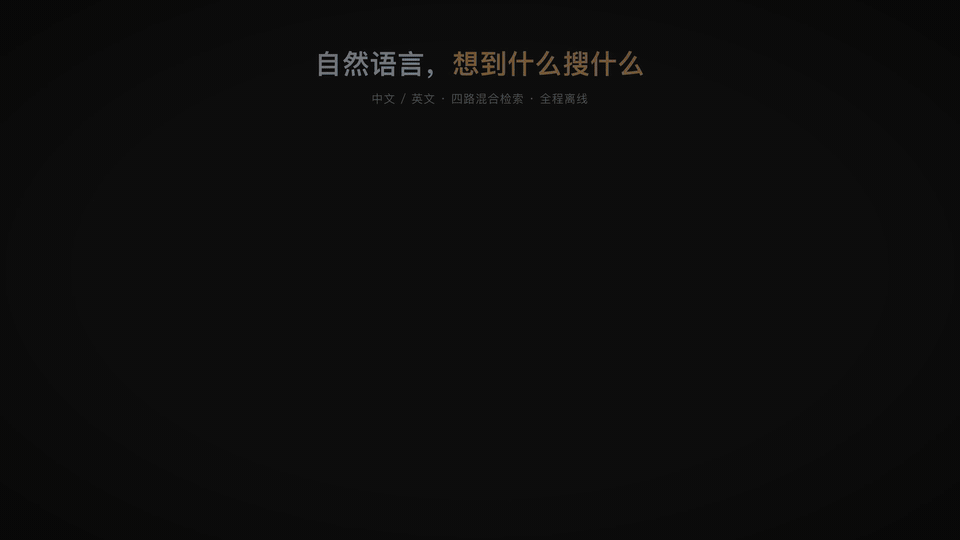
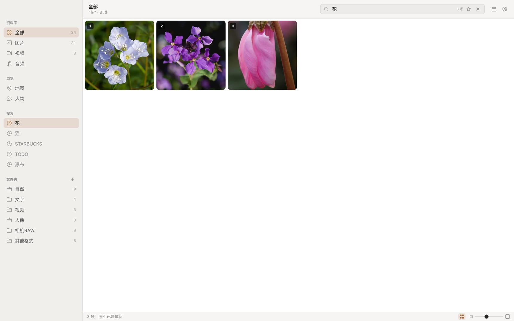
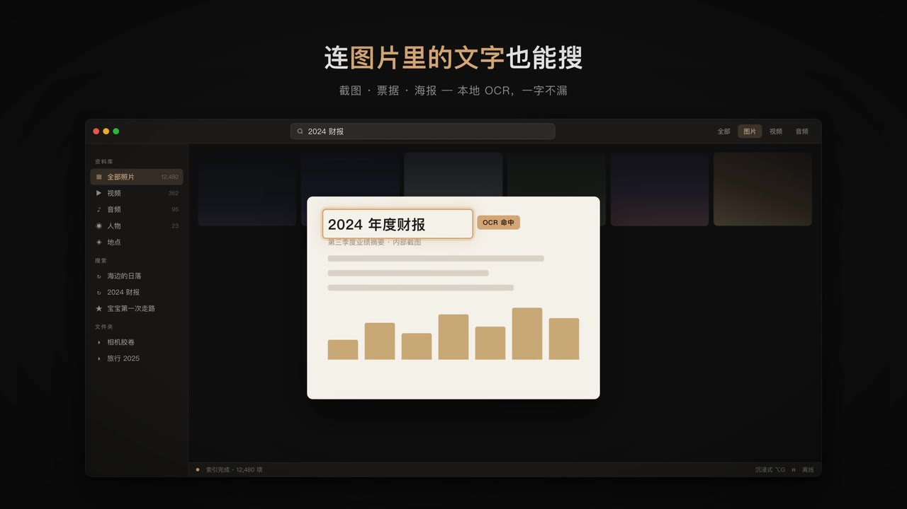
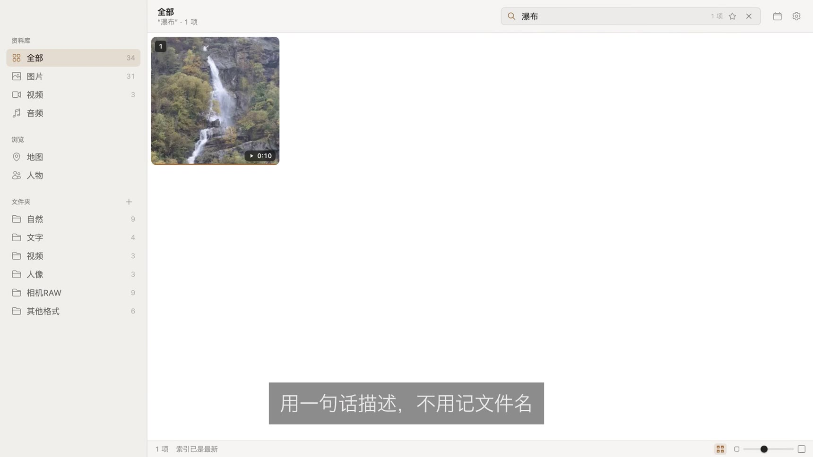
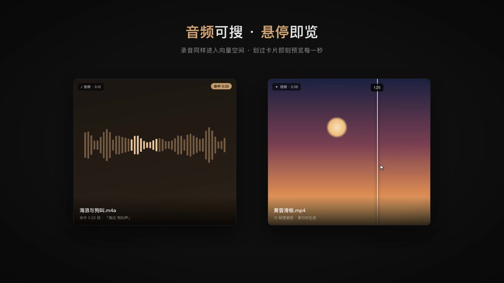
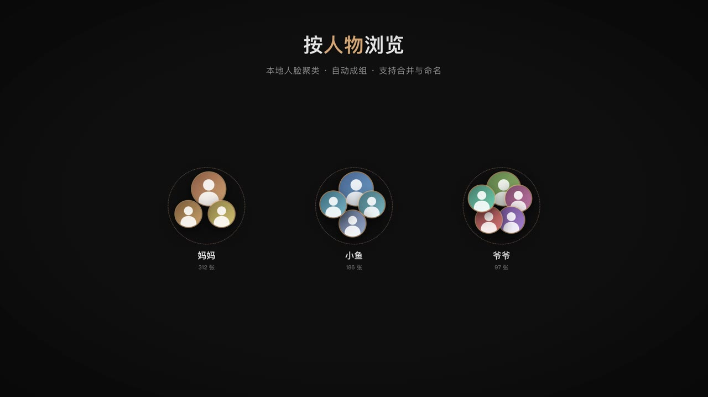
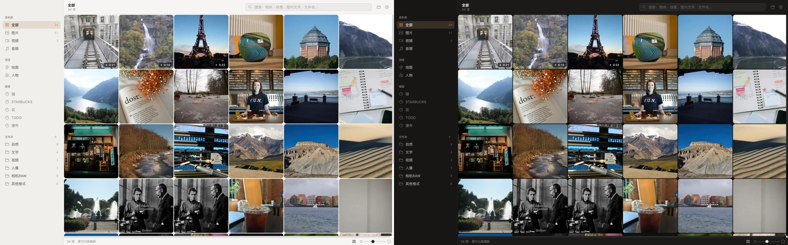

<div align="center">


# Vixel

**重新认识你的照片库。**
本地 AI 照片 / 视频 / 音频搜索 —— 全程离线，数据不出设备，无需 API Key。

*AI-powered local search for photos, videos and audio. Private. Fast. No cloud.*

<a href="https://github.com/RGB-loop/VixelPhotos/raw/main/docs/media/vixel-promo.mp4">
  
</a>

▶ [下载完整宣传片（66 秒 · 1080p · 含配乐 · 5.9 MB）](https://github.com/RGB-loop/VixelPhotos/raw/main/docs/media/vixel-promo.mp4)

</div>

---

## 它能做什么

### 自然语言搜索
输入"海边的日落""宝宝第一次走路"，直接找到对应的照片和视频片段。
EmbeddingGemma 2 把文字、图片、视频、音频放进**同一个多语言向量空间**，
再和图内文字、文件名一起做四路 RRF 融合 —— 中文、英文都行，搜索延迟几十毫秒。



### 连图片里的文字也能搜
本地 PaddleOCR v5 识别截图、票据、海报、路牌里的文字，结巴分词 + SQLite FTS5 全文检索。
搜"2024 财报"，即使那张截图从没被命名过也能找到。



### 视频：直接跳到那一刻
每个视频按 32 秒切段，每段的画面（每秒 1 帧）和声音一起编码成一个向量。
搜"沙滩上狗在叫"，命中的是**听到的**和**看到的**；打开详情自动跳到命中的那一段，
时间轴上高亮显示。网格里悬停即可拖动预览。



### 音频可搜 · 悬停即览
mp3 / m4a / wav / flac 等独立音频文件同样按段进入向量空间；封面缺失时自动生成波形图。



### 按人物浏览
SCRFD 人脸检测 + MobileFaceNet 512 维特征 + sqlite-vec 近邻索引。
按人脸质量（大小 / 角度 / 清晰度）把关，只在很确定时自动归入，其余批量聚类；
双击命名、拖拽合并、"是同一个人吗？"合并建议、"不是此人"、隐藏路人。



### 明暗随心 · 进度可见
浅色 / 深色 / 跟随系统；状态栏点开任务抽屉，看当前正在处理的文件、每段进度、
预计剩余时间，失败任务可一键重试。索引在独立的低优先级进程里跑，界面始终跟手。



> 以上画面来自宣传片，为示意演示；界面以实际应用为准。

### 还有

- **地图视图** —— 带 GPS 的照片落在地图上，大量照片自动聚合。
- **相似照片** —— 任意照片一键找视觉相近的。
- **去重** —— xxHash64 内容哈希，同一张照片在多个文件夹里只算一次、只索引一次。
- **HEIC / RAW** —— macOS 上通过系统 `sips` 解码 CR2 / CR3 / NEF / ARW / DNG / RAF / ORF / RW2，保留 EXIF。
- **快速查看** —— 空格预览，⌘1–5 切换 全部 / 图片 / 视频 / 音频 / 地图。
- **命令行** —— `vixel search "海边" --json`，方便脚本和 Agent 调用（见下文）。

## 隐私

- **零网络请求**：所有模型随应用分发，在本机运行；没有账号、没有遥测、没有云端。
- 照片原文件只读不写；索引、缩略图都存在本机的应用数据目录里。

## 快速开始

需要 Node.js 20+。目前主要在 macOS（Apple Silicon）上开发和测试。

```bash
npm install
npm run models:download   # 下载 EmbeddingGemma 2 + PaddleOCR，约 640 MB（只需一次）
npm run dev               # 开发模式（开发期也会显示 Vixel 名称和图标）
```

打包：

```bash
npm run build && npm run package   # 产物在 release/
```

### 第一次使用

1. **⌘O** 或 设置 → 文件夹，添加照片文件夹。
2. 自动开始索引：缩略图 → 语义向量 → 视频 / 音频分段。点状态栏可以看进度、暂停。
3. 可选：设置里开始**图内文字扫描**（OCR）；人物页开始**人脸扫描**。
4. 在搜索框（**⌘F**）里用自然语言描述你要找的东西。

设置 → 模型 可以分别为文本 / 视觉 / 音频编码器选择 q4 或 q8 量化（默认 q4 / q4 / q8）。
`models:download` 只下载默认档位，切换前请先下载对应文件。

## 支持的格式

| 类型 | 扩展名 |
|---|---|
| 图片 | jpg · jpeg · png · webp · gif · bmp · tiff · avif · heic · heif |
| RAW | cr2 · cr3 · nef · arw · dng · raf · orf · rw2 |
| 视频 | mp4 · mov · m4v · webm · mkv · avi |
| 音频 | mp3 · m4a · aac · wav · flac · ogg · opus |

| 平台 | 常见图片 | HEIC / HEIF | RAW | 视频 / 音频 |
|---|---|---|---|---|
| macOS | ✅ sharp | ✅ sips | ✅ sips | ✅ ffmpeg |
| Linux / Windows | ✅ sharp | ✅ heic-convert | ⚠️ 计划中 | ✅ ffmpeg |

内置播放器播不了的编码（如部分 mkv / avi）会提示用系统播放器打开，搜索和索引不受影响。

## 工作原理

```
┌───────────────────────────────┐  postMessage   ┌──────────────────────────────────┐
│ Main 进程                      │ ─────────────► │ 推理进程（utilityProcess, nice 10）│
│ SQLite + sqlite-vec + FTS5    │ ◄───────────── │ EmbeddingGemma 2  文本/图/视频/音频 │
│ 文件监听 (chokidar)            │                │ SCRFD + MobileFaceNet  人脸        │
│ 索引队列 · 四路 RRF 搜索        │                │ PaddleOCR v5  图内文字             │
│ vixel:// 协议（缩略图 / 流媒体） │                └──────────────────────────────────┘
└──────────────┬────────────────┘
               │ spawn                    ffmpeg-static：抽帧 / 音轨 / 封面 / 悬停预览图
               │ contextBridge
┌──────────────▼────────────────┐
│ Renderer (React + Tailwind)   │  网格 · 详情 · 人物 · 地图 · 任务抽屉 · 设置
└───────────────────────────────┘
```

| 能力 | 方案 |
|---|---|
| 多模态向量 | EmbeddingGemma 2（768 维，ONNX，transformers.js） |
| 向量检索 | sqlite-vec `vec0`：图片 768d · 媒体片段 768d · 人脸 512d |
| 文字检索 | PaddleOCR v5 + @node-rs/jieba（SQLite UDF）+ FTS5 BM25 |
| 融合 | 图片向量 + 媒体片段向量 + OCR + 文件名，Reciprocal Rank Fusion |
| 人脸 | SCRFD-2.5G-KPS 检测 → 五点对齐 → MobileFaceNet → 质量门控聚类 |
| 图像 | sharp (libvips) + macOS `sips` 兜底 |

数据位置（macOS）：

```
~/Library/Application Support/vixel/
├── library.db            # SQLite (WAL)：照片、向量、OCR、人脸、人物、任务队列
├── thumbnails/           # 按内容哈希共享的缩略图
├── video_frames/         # 视频代表帧、音频封面 / 波形、悬停预览图
└── backups/              # 每日自动备份，保留 3 份
```

更多设计细节见 [Vixel_Tech.md](Vixel_Tech.md)，产品需求见 [Vixel_PRD.md](Vixel_PRD.md)。

## 命令行

```bash
npm run cli -- search "海边的日落" --limit 10 --json
npm run cli -- similar 42
npm run cli -- people
npm run cli -- stats
```

支持 `search` · `info` · `similar` · `people` · `stats` · `caption` · `folders`，
`--json` 输出便于脚本和 AI Agent 调用。需要先运行一次应用以创建照片库。

## 开发

```
src/
├── main/            # Electron 主进程：IPC、菜单、vixel:// 协议、推理进程入口
├── preload/         # contextBridge API
├── shared/          # main / renderer 共享类型
├── core/            # 与 UI 无关的核心：db · watcher · indexer · search · fusion
│   ├── embedding/   #   EmbeddingGemma 2（本地 / 转发到推理进程）
│   ├── inference/   #   推理进程转发协议
│   ├── face/        #   检测 · 对齐 · 特征 · 质量 · 聚类
│   ├── ocr/         #   PaddleOCR det / cls / rec
│   ├── video/ audio/ media/ image/ text/
├── renderer/src/    # React UI：shell · media · tasks · settings · inspector …
└── cli/             # vixel 命令行
```

```bash
npm test                              # vitest 单元测试
npx tsc --noEmit -p tsconfig.web.json # 类型检查（renderer）
npx tsc --noEmit -p tsconfig.node.json
```

欢迎贡献，见 [CONTRIBUTING.md](CONTRIBUTING.md)；变更记录见 [CHANGELOG.md](CHANGELOG.md)。

## 许可

[MIT](LICENSE)。宣传片配乐为原创合成，随仓库以同一许可发布。
